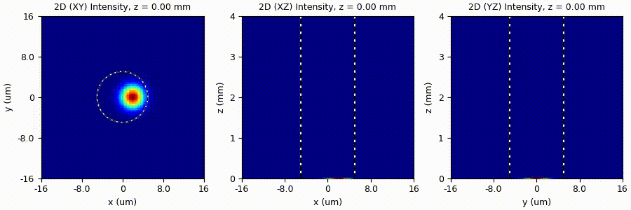
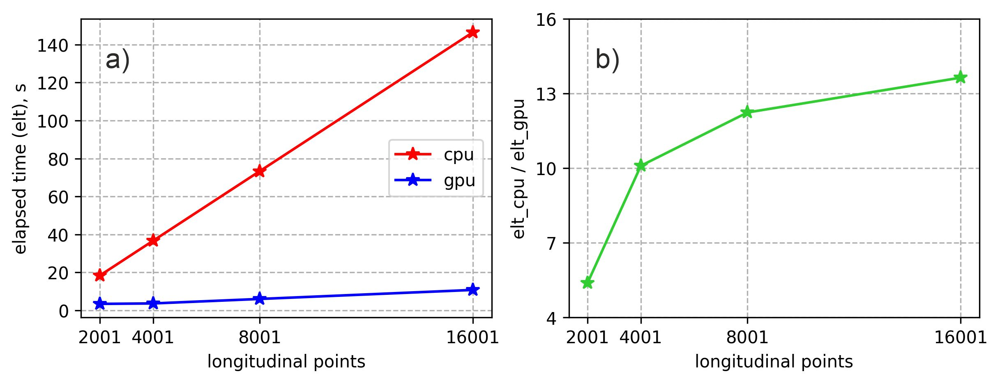
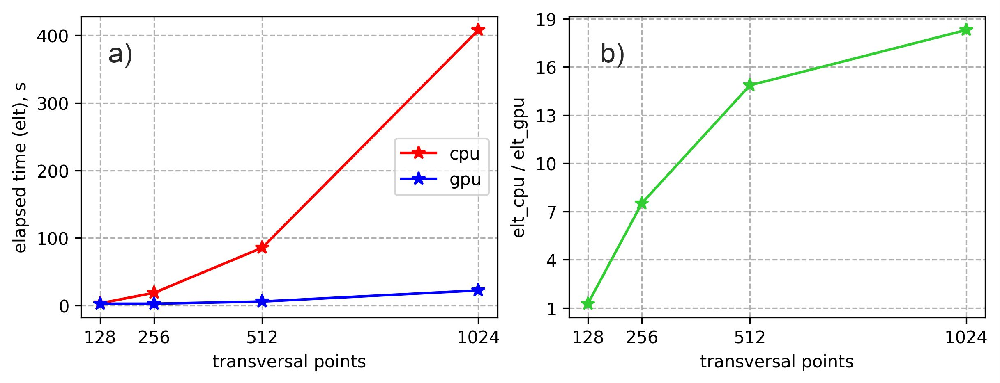

# 3D Beam Propagation Method (CPU vs GPU)

The code presented in this repository implements a scalar Split-step Fourier Beam Propagation Method (FFT BPM). FFT BPM involves numerous Fast Fourier Transform (FFT) and Inverse Fast Fourier Transform (IFFT) operations. It is well known that FFT can be efficiently performed on a GPU. Here, I compare two Python scripts, *bpm_cpu.py* and *bpm_gpu.py*, which implement FFT BPM on a CPU and a GPU, respectively.

Physical and mathematical details of the BPM method can be found in the following references [1, 2].

## Benchmark

Gaussian beam propagation in a multimode optical fiber is used as a benchmark. Physical details on multimode optical fibers can be found, for example, in [3]. The fiber length was chosen to be short (4 mm) to better show the evolution of the beam. The diameter of the fiber’s core is 10 µm, and the input beam is shifted by 2 µm along the x-axis to excite a higher-order mode. As a result, the fundamental mode (LP01) as well as the higher-order mode (LP11e) are excited, leading to mode interference. A video of the beam propagation along the fiber’s z-axis is shown in Fig. 1. The evolution of the beam along the z-axis demonstrates a periodic behavior in the XZ-plane. In the XY-plane, we observe a periodic shift of the beam. The period of the intensity oscillations is determined by the difference between the propagation constants of the LP01 and LP11e modes and in the given case is approximately 0.7 mm.

Fig. 1. Video of the Gaussian beam propagation in a multimode optical fiber, demonstrating the mode interference effect.

## Tests (CPU vs GPU)

The Python script *bpm_cpu.py* implements FFT BPM on a CPU, while *bpm_gpu.py* implements the same method on a GPU using CuPy.

Fig. 2 shows a comparison of CPU and GPU script performance for an increasing number of longitudinal points (z-points). 
The elapsed time (elt) increases almost linearly with the number of points, as shown in Fig. 2 a). However, elt_cpu grows much faster than elt_gpu. Fig. 2 b) shows the ratio elt_cpu / elt_gpu, demonstrating that for more than 4001 points, *bpm_gpu.py* is at least 10 times faster.

Fig. 2. Comparison of CPU and GPU script performance for an increasing number of longitudinal points (x, y-points = 256).

Fig. 3 compares the performance of CPU and GPU scripts for an increasing number of transverse points (x, y-points). 
Here, the elapsed time increases nonlinearly with the number of points, as shown in Fig. 3 a). 
Again, elt_cpu grows much faster than elt_gpu. Fig. 3 b) shows the ratio elt_cpu / elt_gpu, indicating that for more than 256 points, *bpm_gpu.py* can be 10 times faster and even more.

Fig. 3. Comparison of CPU and GPU script performance for an increasing number of transverse points (z-points = 2001).

## Conclusions

The results demonstrate that using a GPU-accelerated FFT BPM is beneficial in almost all cases compared to FFT BPM on a CPU. The advantage of GPU acceleration becomes especially significant when a large number of points are used. In such cases, the GPU-accelerated FFT BPM can be 10 times faster and more.

It is important to note that, for the given benchmark problem, the absolute elapsed time remains relatively small for both CPU and GPU scripts (on the order of hundreds of seconds). However, for long fibers with centimeter- or meter-scale lengths, the computational time can become significant and GPU-accelerated code is able to save much time in this case.

## References

1. [Beam propagation method](https://en.wikipedia.org/wiki/Beam_propagation_method)
2. K. Kawano, T. Kitoh, Introduction to Optical Waveguide Analysis: Solving Maxwell’s Equations and the Schrödinger Equation (John Wiley & Sons, 2001).
3. [Multimode fibers](https://www.rp-photonics.com/multimode_fibers.html)

### Hardware

CPU: AMD Ryzen 5 5600H

GPU: NVIDIA GeForce RTX 3050 Laptop GPU